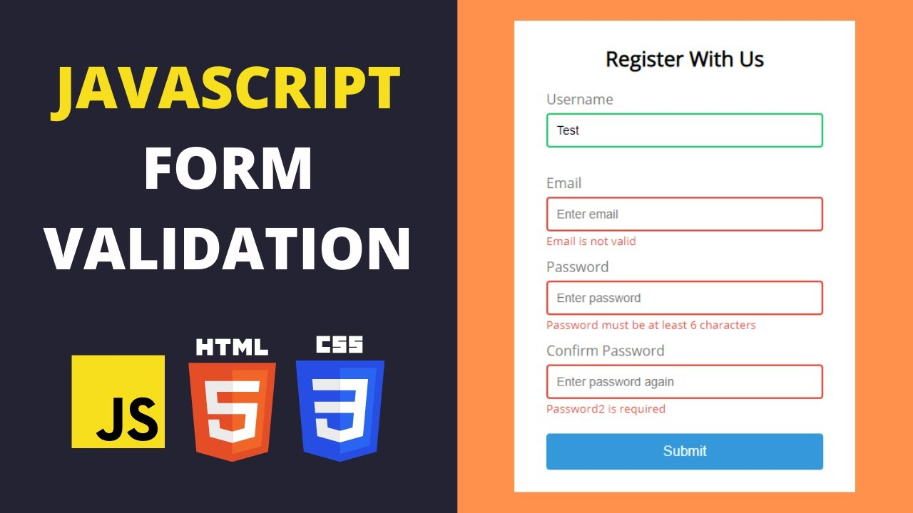

# Forms with JavaScript

 

  

  <h3 align="center">Foreword</h3>

  

    Demonstrating form validation with parsley and HTML5 built-in attributes.
     
    <a href="https://github.com/jgome284/basic-js/issues">Report Bug</a>
    ·
    <a href="https://github.com/jgome284/basic-js/issues">Request Feature</a>
  

## Table of Contents

- [Forms with JavaScript](#forms-with-javascript)
  - [Table of Contents](#table-of-contents)
  - [About](#about)
  - [Getting started](#getting-started)
  - [License](#license)

<!-- ABOUT -->
## About

This repository demonstrates form validation techniques with HTML 5 built-in attributes and the parsley.js library.

<!-- GETTING STARTED -->
## Getting started

Git clone this repository to a local repository. This will give you access to all the files. Once downloaded, open the `login.html` file to kick start the form workflow. This will prompt you for email and password input... there is logic involved to validate your entry but you can put in whatever you'd like as long as it abids by form requirements. You'll know what they are if you make a mistake! 😉

Once you get past the login screen, you'll be directed to the form via `form.html`. Submit your order for a burger 🍔 and you'll find success at `success.html`!

## License

Distributed under the MIT License. See `LICENSE` for more information.
